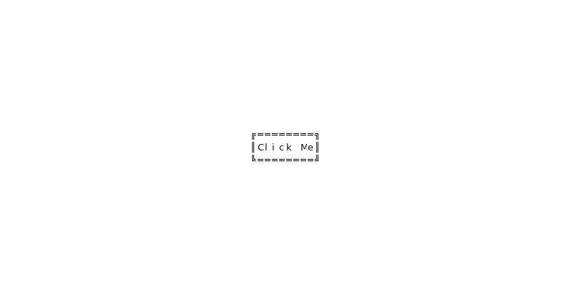
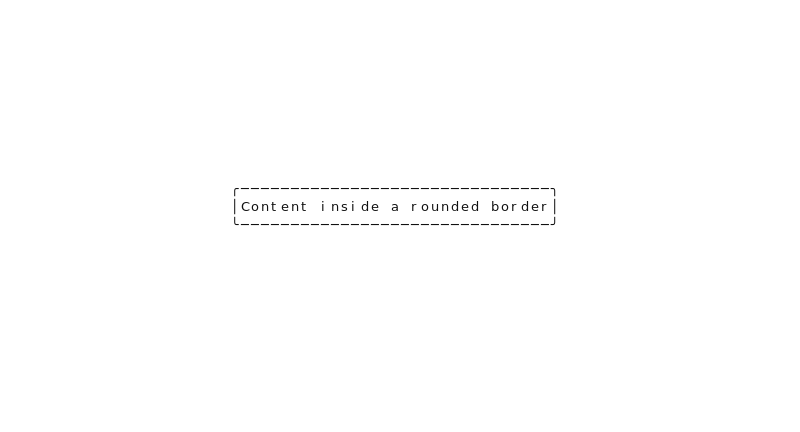
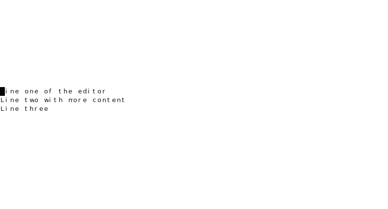

# Thoth

A .NET 10 terminal UI framework. Declare widgets, compose layouts, handle events — Thoth renders to any terminal with true-color fidelity.

Built for AOT-compiled applications. No reflection. No allocations on the hot path.

---

## Widgets

| Widget | Description |
|---|---|
| `Screen` | Root widget — owns the terminal surface |
| `StackPanel` | Vertical stack layout |
| `DockPanel` | Header / footer / fill content areas |
| `Viewport` | Scrollable container |
| `Align` | Horizontal and vertical centering |
| `Border` | Bordered container with rounded, sharp, or inset styles |
| `OverlayWidget` | Composites an overlay on top of background content |
| `ModalDialog` | Titled dialog with footer buttons |
| `TextBlock` | Text display with word-wrap, clip, or marquee overflow |
| `TextEditor` | Multi-line text input with selection, word navigation, paste |
| `TextBar` | Single-line label bar with left / center / right titles |
| `Button` | Clickable button with hover and focus events |
| `ButtonGroup` | Ordered group of buttons with selection tracking |
| `Toggle` | On/off toggle control |
| `SingleChoiceList` | Single-selection list |
| `MultipleChoiceList` | Multi-selection list |
| `ProgressBar` | Fill progress indicator (solid or gradient) |
| `Spinner` | Animated spinner (ASCII, Dots, Braille dials) |

---

## Why Thoth

**AOT-first.** The library targets .NET 10 with `IsAotCompatible=true`. No reflection, no `dynamic`, no runtime code generation. Deploy as a native single-file binary.

**Measure → Arrange → Draw.** A strict three-phase pipeline separates layout from rendering. Measure declares desired sizes, Arrange assigns final rectangles, Draw writes to the grid. Phases never bleed into each other.

**Incremental rendering.** Thoth tracks invalidation per widget. Only dirty regions are redrawn each frame. Full re-renders are opt-in.

**True-color themes.** Five built-in themes with RGB, xterm-256, and ANSI fallbacks. Switch at runtime. Define your own in JSON.

**CSS-only animated SVGs.** The test suite generates animated SVG previews of every widget using CSS `@keyframes` — no JavaScript, no browser required, embeddable directly in GitHub READMEs and documentation.

---

## Previews

<p align="center">
  
  
  
  
</p>

---

## Getting started

```csharp
var screen = new Screen { Title = "My App" };

var panel = new DockPanel();
panel.Add(new Dock
{
    Position = DockPosition.Top,
    Content = new TextBar { LeftTitle = "My App", RightTitle = "v1.0" }
});
panel.Add(new Dock
{
    Position = DockPosition.Fill,
    Content = new TextBlock
    {
        Text = "Hello from Thoth.",
        Overflow = TextOverflow.Wrap
    }
});

screen.Add(panel);
```

---

## Composing layouts

Widgets compose freely. Wrap anything in `Align` to center it:

```csharp
var dialog = new ModalDialog
{
    Title = "Confirm",
    Width = 50,
    Height = 10,
    Content = new TextBlock { Text = "Proceed?", Overflow = TextOverflow.Wrap }
};
dialog.FooterButtons.Add(new Button { Text = "OK" });
dialog.FooterButtons.Add(new Button { Text = "Cancel" });

screen.Add(new Align
{
    HorizontalAlignment = HorizontalAlignment.Center,
    VerticalAlignment = VerticalAlignment.Center,
    HeightSizeMode = HeightSizeMode.Fill,
    Content = dialog
});
```

---

## Events

```csharp
var button = new Button
{
    Text = "Submit",
    OnClick = () => Submit(),
    OnFocus = () => Highlight(),
    OnBlur = () => Unhighlight(),
    OnMouseEnter = () => ShowTooltip(),
    OnMouseLeave = () => HideTooltip()
};
```

Keyboard, mouse, text input, and paste events are all routed through a single `EventDispatcher`. Focus is managed by `AttentionManager`.

---

## Themes

```csharp
// Load a built-in theme
Themes.Load("thoth");
Themes.SwitchToVariant("dark");
```

Built-in themes:

| ID | Variant | Character |
|---|---|---|
| `thoth` | dark | Deep lapis with gilded ivory and ruby |
| `thoth` | light | Sunlit limestone with dark ink |
| `comptatata-70s` | dark | Espresso and amber — warm, retro terminal |
| `comptatata-70s` | light | Cream paper with brown ink |
| `comptatata-neutral` | dark | System baseline |

Each theme defines nine semantic color slots — `background`, `text`, `dim`, `border`, `accent`, `notify`, `success`, `warning`, `error` — with RGB, xterm-256, and ANSI fallbacks.

---

## Rendering pipeline

```
Measure  →  sizes widgets bottom-up under parent constraints
Arrange  →  assigns final rects top-down
Draw     →  writes glyphs and colors to the grid buffer
```

Each phase is implemented as a visitor tree walk. Measure is side-effect free. Arrange writes rects into `FrameLayoutState` owned by the engine. Draw is render-only — layout is never rebuilt inside Draw.

---

## Building

```bash
dotnet build src/Thoth.slnx
dotnet test src/Thoth.Tests/Thoth.Tests.csproj
```

Requires .NET SDK 10.0.101 (see `global.json`).

---

## License

MIT
